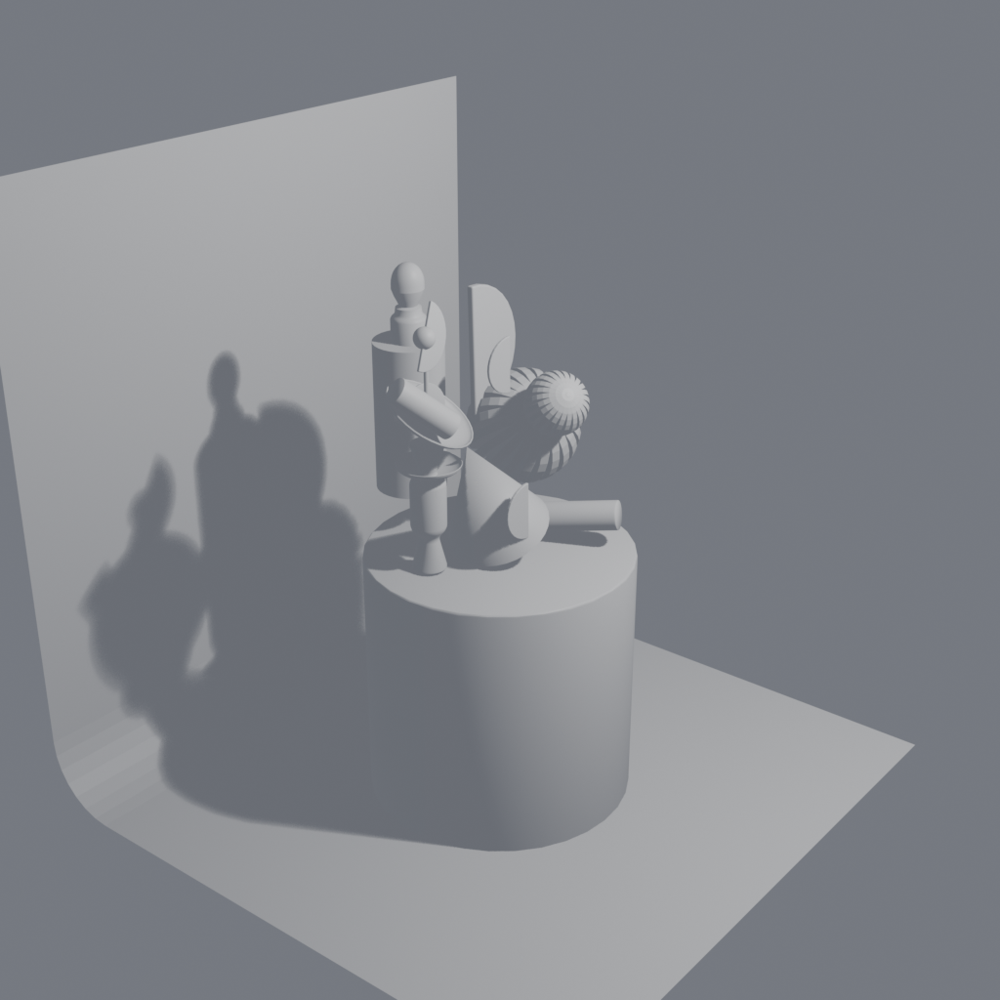

# blender-illustration

Élément d'illustration / décor (blockout). Ensemble de 20 meshes composant une scène ou un prop illustratif du monde de Primea.

> Asset extrait du projet **Aetheria-Frontier** (univers de Primea).

## Aperçu



## Détails du modèle

| Propriété | Valeur |
|-----------|--------|
| Fichier Blender | `illustration.blend` |
| Meshes | 20 |
| Vertices | 2,532 |
| Faces (tris/quads) | 2,201 |
| Matériaux | _aucun (vue wireframe/matcap)_ |

## Structure du dépôt

```
blender-illustration/
├── illustration.blend   # source Blender (blockout)
├── preview.png   # rendu d'aperçu 1024x1024
├── README.md
└── .gitignore    # ignore les sauvegardes *.blend1
```

## Remarques

- Modèle de **blockout** : topologie et matériaux destinés à la pré-production / au greyboxing.
- Rendu d'aperçu généré sous Blender (EEVEE, éclairage studio neutre).
- Les fichiers `*.blend1` de sauvegarde automatique sont exclus du versioning.

## Licence

Propriété de Utopia Software Entertainment — usage interne au projet Aetheria-Frontier.
